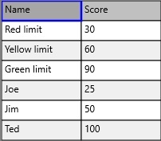
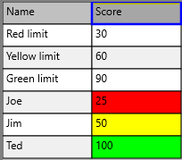
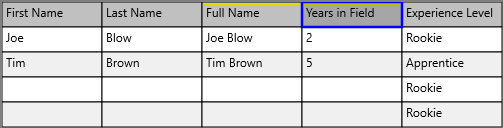
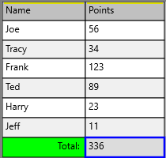
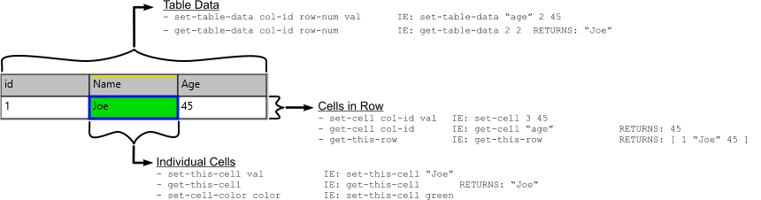

:experimental:
= Table Template User Documentation
:author: @toomasv, @mikeyaunish
:version: 0.117
:revdate: 20-Feb-2026
:toc: left
:toclevels: 3
:sectnums:
:icons: font
:source-highlighter: highlight.js

== Introduction

The Table Template is a comprehensive Red language VID style that provides spreadsheet-like functionality with advanced features including cell editing, column overlays, virtual columns, sorting, filtering, freezing rows/columns, and much more.

=== Overview

The `table-template.red` file provides a complete table widget implementation for Red/View applications. It supports:

* Data manipulation (insert, delete, move rows and columns)
* Cell editing with multiple data types
* Column overlays (VID widgets and code overlays)
* Virtual columns with dynamic content
* Row and column freezing
* Sorting and filtering
* Cell formatting and styling
* Named ranges
* State saving and loading
* Keyboard navigation
* Context menus

=== Version Information
* **Version:** 0.117
* **Date:** 20-Feb-2026
* **Repository:** https://github.com/mikeyaunish/table-template[GitHub]

=== Dependencies

The table template requires the following support scripts:

* `table-template-support-scripts/style.red`
* `table-template-support-scripts/re.red`
* `table-template-support-scripts/to-valid-types.red`
* `table-template-support-scripts/table-template-support-scripts.red`
* `table-template-support-scripts/requesters.red`
* `table-template-support-scripts/request-array.red`

== Quick Start

NOTE: If you would rather just see the code in action, all of the examples in this documentation can be found in the `/examples-gallery` folder. Just run the `examples-gallery.red` program and select the example you want to see. You are free to change and experiment with the code as you see fit.

== Getting Started

=== Basic Usage

The table template is a VID style. To enable the table style, include the file:

[source,red]
----
#include %table-template.red
----

After that, the table style can be used in a layout. Here's a basic example:

[source,red]
----
view [
    table data [
        ["Name" "Age" "City"]
        ["John" 25 "New York"]
        ["Jane" 30 "London"]
    ]
]
----

This creates an empty table with default size of 317x217 and grid 3x8. Default cell size is 100x25. Both vertical and horizontal scrollers are always included. Scrollers are 17 points thick.

=== Specifying Table Size

Specifying size for table will fill the extra space with additional cells:

[source,red]
----
view [table 717x517]
----

This creates an empty table with 7x20 grid.

=== Specifying Grid Size

Grid size of table can be specified separately:

[source,red]
----
view [table 717x517 data 10x50 options [auto-col: #(true)]]
----

This creates an empty table with 10 columns and 50 rows, but within the previous boundaries (717x517).

When instead of grid size a block is presented as data, this block is interpreted as table data. The block should consist of row blocks of equal size:

[source,red]
----
view [table 717x517 data [["" A B][1 "First Row"][2 "Second Row"]]]
----

Values are automatically formatted to be presented in the table.

=== Using the `auto-col` option

The table can be initialized with various options:

[source,red]
----
view [
    table data [
        ["Header1" "Header2"]
        ["Data1" "Data2"]
    ] options [
        auto-col: yes       ; Provides columns with automatic numbering
    ]
]
----

=== Using the `auto-save` option
The table can also load data from a file and enable auto-save functionality:

[source,red]
----
view [
    table data %./data/simple-table.redtbl
    options [
        auto-save: yes      ; Auto-save to file
    ]
]
----

When `auto-save` is enabled, changes to the table are automatically saved to the source file. This is useful for maintaining data persistence, but note that this can slow down table operations, especially with large files. This feature is most useful when first creating a table or when you are not dealing with a large amount of data. 

NOTE: If you are using the `auto-save` option in your external Red program, you should disable it when you are done making changes to the table. This is to avoid slowdowns when the table gets larger.

=== Auto-Indexed Columns

It is possible to add an automatically indexed column to your table by specifying the corresponding option. When `auto-col` is set to `true`, an extra column will be created, automatically enumerated. By this, the original order of rows can be restored whenever necessary:

[source,red]
----
view [table 717x517 data 10x50 options [auto-col: #(true)]]
----

=== Auto-Indexed Rows

Both row and column headers can be specified in this manner:

[source,red]
----
view [table 717x517 data 10x50 options [auto-col: #(true) auto-row: #(true)]]
----

Auto-generated headers refer to the position of the given row/col in original data. The index row/col itself has index 0.

=== Sheet Mode
The sheet mode is a special mode that allows you to create a table that is similar to a open blank spreadsheet.
Another way to auto-generate indexes is by using the `sheet` option:

[source,red]
----
view [table options [sheet: #(true)]]
----

* Headers generated with `sheet` option refer to the actual visual order of rows/cols, not to their order in original data
* When sorting, headers generated with `sheet` option will not change, but headers generated with `auto-col` and `auto-row` will be reordered

=== Loading from File

The table can load data from `.red` or `.redtbl` files:

[source,red]
----
view [
    table data %mydata.red
]
----

=== Loading from CSV Files

Instead of giving data directly as a block, a file name or URL may be specified to be loaded as a table:

[source,red]
----
view [
    table 717x515 
    data https://support.staffbase.com/hc/en-us/article_attachments/360009197011/username-password-recovery-code.csv 
    options [delimiter: #";"]
]
----

Non-standard delimiter (standard is comma) can currently be specified for URLs only.

=== Loading from SQL Queries

If you have set up SQLite, a data source may be specified as an SQL query. The 'chinook.db' can be found https://www.sqlitetutorial.net/wp-content/uploads/2018/03/chinook.zip[here].

[source,red]
----
sql-query: func [sql][
    out: copy ""
    call/output rejoin [{sqlite3 -csv -header .\chinook.db "} sql {"}]  out
    load/as out 'csv
]
view [
    table 717x517 with [
        data: sql-query "select TrackId, Name, Title, Composer from tracks inner join albums on tracks.AlbumID = albums.AlbumId"
    ]
]
----

=== Basic Table

[source,red]
----
view [
    title "Basic Table"
    table data [
        ["Name" "Age" "City"]
        ["John" 25 "New York"]
        ["Jane" 30 "London"]
        ["Bob" 35 "Paris"]
    ]
]
----

=== Table with Frozen Header

[source,red]
----
view [
    title "Table with Frozen Header"
    table data [
        ["Name" "Age" "City"]
        ["John" 25 "New York"]
        ["Jane" 30 "London"]
    ] options [
        config: [
            frozen-rows: [1]
        ]
    ]
]
----

=== Table with dropdown-list overlay

[source,red]
----
view [
    title "Table with Dropdown"
    table data [
        ["Name" "Status"]
        ["John" "Active"]
        ["Jane" "Inactive"]
    ] options [
        config: [
            frozen-rows: [1]
        ]
    ]
]
----
1. After creation Right-click on column 2
2. Select Menu item: `Column > Overlay > Apply repeating VID` 
3. Select `data-drop-list`

=== Loading from File

[source,red]
----
view [
    title "Table from File"
    table data %mydata.red
]
----

== Advanced Examples

==== Coloring Cells Based on Data
This example illustrates how to use the `get-table-data` , `set-cell-color` and `get-this-cell` functions to get the data from a column and use it to color other cells in the column. This example also illustrates the use of the `row-num` and `col-num` variables to get the current row and column number.

* Open the table-lab.red program
* Open the table: /examples-gallery/get-table-data-example-no-code.redtbl
* It should look like this:

* Add a Code Overlay to the "Score" column by right clicking on the column header and selecting the Menu: `Column > Overlay > Apply Repeating Code` and select the `cell-New-Code-Overlay` option. This will open a Code Editor window. Copy and paste the code below into the code window and click OK.

[source,red]
----
if row-num > 4 [	;-- skip the first 4 rows where our reference data is located
	if get-this-cell <= (get-table-data col-num 2) [ ;-- row #2 is the red limit
		set-cell-color red
	]
	if all [
		get-this-cell > (get-table-data col-num 2)		;-- row #2 is the red limit
		get-this-cell <= (get-table-data col-num 3) 	;-- row #3 is the yellow limit
	][
		set-cell-color yellow
	]
	if all [
		get-this-cell > (get-table-data col-num 3) ;-- row #3 is the green limit
	][
		set-cell-color green
	]
]
----
The resulting table should look like this:

This is the standard procedure for adding a Code Overlay to a column.

=== Setting and Getting Cell Data

This example illustrates how to use the functions: `set-cell`, `get-cell`, `set-this-cell` and `get-this-cell` to set and get the value of a cell.

* Open the table-lab.red program
* Open the table: /examples/set-cell-example.red
* It should look like this:

There is a Code Overlay on the column named: "Full Name" which contains the code:

[source,red]
----
set-this-cell rejoin [ (get-cell "first-name") space (get-cell "last-name") ]
----
You can inspect and change this code by right clicking on the column header and selecting `Column > Overlay > Edit Overlay` (or press Alt+F2).

The "Years in Field" column has a Code Overlay with the code:

[source,red]
----
if get-this-cell < 2 [ set-cell "experience-level" "Rookie" ] ;-- less than 2 years is Rookie
if all [
	get-this-cell > 3 
	get-this-cell < 6 ;-- between 3 and 6 years is Apprentice
][
	set-cell "experience-level" "Apprentice"
]
if get-this-cell > 20 [ set-cell "experience-level" "Master" ] ;-- greater than 20 years is Master
----

You can inspect and change this code by right clicking on the column header and selecting `Column > Overlay > Edit Overlay` (or press Alt+F2).

* Enter data into the "First Name" and "Last Name" cells and observe how the "Full Name" column is updated.
* Enter data into the "Years in Field" cells and observe how the "Experience Level" column is updated.

=== Creating a Highlighted Total Row

This example illustrates how to use the functions: `set-table-data` and `set-cell-color` to create a highlighted total row. Also shows how to use the `table-obj` variable to access meta-data about the underlying table.

NOTE: If you are using the `table-obj` variable in your external Red program, you should replace it with the table's face object name. This avoids conflicts that may occur when using multiple tables.

* Open the table-lab.red program
* Open the table: /examples/set-table-data-example.red
* It should look like this:

The `Name` column has a Code Overlay with the code:
[source,red]
----
if row-num = ( last table-obj/row-index ) [     ;-- Once we are at the last row
	set-this-cell "                    Total:" 
	set-cell-color green
]
----

The `Points` column has a Code Overlay with the code:
[source,red]
----
last-row: (last table-obj/row-index)
if row-num = last-row [
	accum: 0
	foreach row table-obj/row-index [
		if all [ 
			row > 1 
			row <> last-row
		][
			if (get-table-data "name" row ) = "                    Total:" [
				;-- This is an old Total line that needs to be removed.
				set-table-data "name" row ""
				set-table-data "points" row 0
			]
			accum: accum + to-valid-integer (get-table-data col-num row)
		]
	]
	set-table-data col-num last-row accum
]
----
As data in the "Points" column is updated, the total is calculated and displayed in the last row. The Overlay will also adapt to any rows being added or removed.

=== Appending data to a table with your own Red program

This example illustrates how to use the functions: `append-row` and `set-data` to append data to a table with your own Red program.

* Run the red program: /examples-gallery/append-data-to-table.red 
* Click on the button `Append Data to Table`
* The table should be updated with the new data.

Here is the code for the button that appends data to the table:
[source,red]
----
on-click [
     table1/actors/append-row table1
     table1/actors/set-data/row/refresh table1 1 (last table1/row-index) 
          reduce [ "Paul" "Brooker" (random 100) "Blue" ] 
          ;-- the new data to be appended to the table
]
----

Open the file /examples-gallery/append-data-to-table.red to see the full code.

== Programming Considerations

=== Code Overlay order of execution

Code overlays are executed in a left to right, top to bottom order. Currently there is no dependency checking, so if a cell depends on the value of another cell, it is best to pull values from a cell that is to the left of the current cell. In the future, dependency checking and circular reference checking will be added to the code overlay engine.

=== Special functions and variables available in the Code and VID Overlay context

**Note:** The use of `this-cell` variable has been deprecated. Use the dedicated getter and setter functions instead (see below).

==== Overview of functions

All Red code in any Overlay has access to the following special functions and variables:

==== Getter Functions

[source,red]
----
USAGE:
     GET-THIS-CELL 

DESCRIPTION: 
     Returns the value of the current Data cell. ONLY available in the Code Overlay context. Operates ONLY on Data cells. 
     GET-THIS-CELL is a function! value.
----

[source,red]
----
USAGE:
     GET-THIS-ROW 

DESCRIPTION: 
     Returns the value of the entire current row. ONLY available in the Code and VID Overlay context. Operates ONLY on Data cells. 
     GET-THIS-ROW is a function! value.
----

[source,red]
----
USAGE:
     GET-CELL col-id

DESCRIPTION: 
     Returns the value of the column given. ONLY available in the Code and VID Overlay context. Operates ONLY on Data cells. 
     GET-CELL is a function! value.

ARGUMENTS:
     col-id       [integer! string!] {A col-id of string! will attempt to match a currently configured column name.}
----

[source,red]
----
USAGE:
     GET-TABLE-DATA col-id row-id

DESCRIPTION: 
     Returns the table data at the col and row given. ONLY available in the Code and VID Overlay context. Operates ONLY on Data cells. 
     GET-TABLE-DATA is a function! value.

ARGUMENTS:
     col-id       [integer! string!] {A col-id of string! will attempt to match a currently configured column name.}
     row-id       [integer!] 

REFINEMENTS:
     /row         => Will return an entire row of data as a block.
----

[source,red]
----
     USAGE:
     GET-COL-HEADER col-id

DESCRIPTION: 
     Returns the value of a given column header. 
     GET-COL-HEADER is a function! value.

ARGUMENTS:
     col-id       [integer!] 
----

==== Setter Functions

[source,red]
----
     SET-THIS-CELL val

DESCRIPTION: 
     Sets the value of the current cell. ONLY available in the Code Overlay context. Operates on both Data and Virtual columns. 
     SET-THIS-CELL is a function! value.

ARGUMENTS:
     val           
----

[source,red]
----
USAGE:
     SET-CELL col-id val

DESCRIPTION: 
     Sets the value of the current cell. ONLY available in the Code Overlay context. Operates on both Data and Virtual columns. 
     SET-CELL is a function! value.

ARGUMENTS:
     col-id       [integer! string!] {A col-id of string! will attempt to match a currently configured column name.}
     val          [any-type!] 
----

[source,red]
----
USAGE:
     SET-TABLE-DATA col-id row-id val

DESCRIPTION: 
     Modify the table data. ONLY available in the Code and VID Overlay context. Operates ONLY on Data cells. 
     SET-TABLE-DATA is a function! value.

ARGUMENTS:
     col-id       [integer! string!] {A col-id of string! will attempt to match a currently configured column name.}
     row-id       [integer!] 
     val          [any-type!] {The data for the single cell or a block if setting an entire row.}

REFINEMENTS:
     /row         => Will modify an entire row, datatypes must match row.
     /refresh     => refresh the view after data modified.
----

[source,red]
----
USAGE:
     SET-CELL-COLOR color-val

DESCRIPTION: 
     Change color of current cell. ONLY available in the Code Overlay context. Operates on both Data and Virtual cells. 
     SET-CELL-COLOR is a function! value.

ARGUMENTS:
     color-val    [tuple!] 
----

==== Variables
[source,red]
----
USAGE:
     ROW-NUM

DESCRIPTION: 
     Returns the current row number. ONLY available in the Code and VID Overlay context. Operates ONLY on Data cells. 
     ROW-NUM is a variable! value.
----

[source,red]
----
USAGE:
     COL-NUM

DESCRIPTION: 
     Returns the current column number. ONLY available in the Code and VID Overlay context. Operates ONLY on Data cells. 
     COL-NUM is a variable! value.
----

[source,red]
----
USAGE:
     TABLE-OBJ

DESCRIPTION: 
     Returns the underlying global table object. If using multiple tables, use the table's face object name instead
     TABLE-OBJ is a variable! value.
----

[source,red]
----
USAGE:
     TABLE-OBJ/TABLE-DATA

DESCRIPTION: 
     Returns the table data. ONLY available in the Code and VID Overlay context. Operates ONLY on Data cells. 
     TABLE-OBJ/TABLE-DATA is a variable! value.
----

[source,red]
----
USAGE:
     TABLE-OBJ/ROW-INDEX

DESCRIPTION: 
     Returns the row index of the table. Negative values are used for Virtual rows.
     TABLE-OBJ/ROW-INDEX is a variable! value.
----

[source,red]
----
USAGE:
     TABLE-OBJ/COL-INDEX

DESCRIPTION: 
     Returns the column index. Operates on Data and Virtual columns. Negative values are used for Virtual columns.
     TABLE-OBJ/COL-INDEX is a variable! value.
----    

=== Table Actors and Variables useful in your Red program

NOTE: A quick start to understanding how the table actors work run the program:
`/examples-gallery/table-CRUD-actors.red` program. 

When accessing table data from your Red program (outside of the Code or VID Overlay context), use the following functions through the table's actors:

==== Table Actors with a CRUD (Create, Read, Update, Delete) perspective
===== CREATE Data
[source,red]
----
USAGE:
     TABLE1/ACTORS/APPEND-ROW face

DESCRIPTION: 
     Appends an empty row at the end of the table data. 
     TABLE1/ACTORS/APPEND-ROW is a function! value.

ARGUMENTS:
     face         [object!] 
----

[source,red]
----
USAGE:
     TABLE1/ACTORS/INSERT-ROW face event

DESCRIPTION: 
     insert row at row specified. 
     TABLE1/ACTORS/INSERT-ROW is a function! value.

ARGUMENTS:
     face         [object!] 
     event        [event! integer!] {when event is integer! this is the row number used.}
----

[source,red]
----
USAGE:
     TABLE1/ACTORS/APPEND-DATA-ROW face val

DESCRIPTION: 
     Appends a row of data at the end of existing data. 
     TABLE1/ACTORS/APPEND-DATA-ROW is a function! value.

ARGUMENTS:
     face         [object!] 
     val          [block!] "block of values that matches the row of data."

REFINEMENTS:
     /refresh     => refresh view after data has been modified.
----

[source,red]
----
USAGE:
     TABLE1/ACTORS/INSERT-DATA-ROW face row-id val

DESCRIPTION: 
     Inserts a row of data at the row specified. 
     TABLE1/ACTORS/INSERT-DATA-ROW is a function! value.

ARGUMENTS:
     face         [object!] 
     row-id       [integer!] 
     val          [any-type!] 

REFINEMENTS:
     /refresh     => refresh view after data has been modified.
----

[source,red]
----
USAGE:
     TABLE1/ACTORS/APPEND-COL face

DESCRIPTION: 
     Append a column to the existing table data. 
     TABLE1/ACTORS/APPEND-COL is a function! value.

ARGUMENTS:
     face         [object!] 

REFINEMENTS:
     /ret-col-num => returns the new column number just created.
----

[source,red]
----
USAGE:
     TABLE1/ACTORS/INSERT-COL face event

DESCRIPTION: 
     Inserts a column at the column specified. 
     TABLE1/ACTORS/INSERT-COL is a function! value.

ARGUMENTS:
     face         [object!] 
     event        [event! none! integer!] {If event is integer! this is the column number used.}

REFINEMENTS:
     /ret-col-num => return the column number that has just been created.
----

===== READ Data

[source,red]
----
USAGE:
     <table-name>/ACTORS/GET-DATA face col-id row-id

DESCRIPTION: 
     Returns table data. 
     <table-name>/ACTORS/GET-DATA is a function! value.

ARGUMENTS:
     face         [object!] 
     col-id       [integer! string!] {A string! col-id will attempt to match a currently configured column name.}
     row-id       [integer!] 

REFINEMENTS:
     /row         => returns entire row of data.

Example Usage:
probe table1/actors/get-data table1 2 3  ;-- get the cell value of column 2 and row 3
probe table1/actors/get-data/row table1 0 2  ;-- get all of row 2
probe table1/actors/get-data table1 "id" 2  ;-- get the cell value of column "id" and row 2
----

===== UPDATE Data

[source,red]
----
USAGE:
     <table-name>/ACTORS/SET-DATA face col-id row-id val

DESCRIPTION: 
     Sets table data and refreshes table display. 
     <table-name>/ACTORS/SET-DATA is a function! value.

ARGUMENTS:
     face         [object!] 
     col-id       [integer! string!] {A col-id of string! will attempt to match a currently configured column name.}
     row-id       [integer!] 
     val          [any-type!] 

REFINEMENTS:
     /row         => 'val block contains full row of pre-formatted data.

Example Usage:
table1/actors/set-data table1 2 3 "New Value"
table1/actors/set-data table1 "name" 3 "New Name"
table1/actors/set-data/row table1 2 ["Value1" "Value2" "Value3"]
----

===== DELETE Data
[source,red]
----
USAGE:
     TABLE1/ACTORS/DELETE-ROW face event

DESCRIPTION: 
     Deletes the specified row. 
     TABLE1/ACTORS/DELETE-ROW is a function! value.

ARGUMENTS:
     face         [object!] 
     event        [event! integer!] {when event is integer!, that row number is deleted.}
----     

[source,red]
----
USAGE:
     TABLE1/ACTORS/CLEAR-DATA face col-id row-id

DESCRIPTION: 
     Clears specified data from the table. 
     TABLE1/ACTORS/CLEAR-DATA is a function! value.

ARGUMENTS:
     face         [object!] 
     col-id       [integer! string!] {A col-id of string! will attempt to match a currently configured column name.}
     row-id       [integer!] 

REFINEMENTS:
     /row         => Clear entire row, ignores col-id.
     /refresh     => refresh view after data has been modified.
----

==== Other table actors

===== Getting Checked Data

[source,red]
----
USAGE:
     <table-name>/ACTORS/GET-CHECKED-ROWS face col-id

DESCRIPTION: 
     Returns rows of data that have been checked by the 'cell-checkbox-for-row-selection' overlay. Use this when the table has a virtual column with that overlay and you need the full row data for checked rows from your Red program.
     <table-name>/ACTORS/GET-CHECKED-ROWS is a function! value.

ARGUMENTS:
     face         [object!] 
     col-id       [integer! string!] {Column number or column name of the checkbox-for-row-selection overlay.}

REFINEMENTS:
     /only        => returns row indices only (no row data).

Example Usage:
probe table1/actors/get-checked-rows table1 -1           ;-- by column number (-1 is a Virtualcolumn)
probe table1/actors/get-checked-rows table1 "rows-selected"  ;-- by column name
probe table1/actors/get-checked-rows/only table1 -1      ;-- row indices only for column -1 (Virtual column)
----

===== Saving Table Data

[source,red]
----
USAGE:
     <table-name>/ACTORS/SAVE-DATA face

DESCRIPTION: 
     Saves the table data to a file. 
     <table-name>/ACTORS/SAVE-DATA is a function! value.
----

[source,red]
----
Example Usage:
table1/actors/save-data table1
----

===== Save Table As

[source,red]
----
USAGE:
     <table-name>/ACTORS/SAVE-TABLE-AS face

DESCRIPTION: 
     Opens a "Save file as" dialog and saves the table to the chosen file. Supports .redtbl, .red, and .csv formats. Returns the file path if saved, or none if cancelled. Updates the table's data source to the new file.
     <table-name>/ACTORS/SAVE-TABLE-AS is a function! value.
----

[source,red]
----
Example Usage:
table1/actors/save-table-as table1
----

====== Refreshing the Table
[source,red]
----
USAGE:
     <table-name>/ACTORS/REFRESH-VIEW face

DESCRIPTION: 
     Refreshes the table display.
     <table-name>/ACTORS/REFRESH-VIEW is a function! value.
----

[source,red]
----
Example Usage:
table1/actors/refresh-view table1
----

NOTE: The following functions will also refresh the table display when the /refresh refinement is used.

* `set-table-data` 
* `set-data` 
* `set-cell`

=== Helper Functions
==== Displaying Details about the Table
[source,red]
----
USAGE:
     TABLE-DETAILS face

DESCRIPTION: 
     Displays details about the table.
     TABLE-DETAILS is a function! value.
----

[source,red]
----
Example Usage:
table-details table1
----

=== RC Cell Referencing System

Virtual columns support an easy cell referencing system:

* `R2C2` - Direct cell data access (row 2, column 2)
* `C2` - Access to specific column data in current row (column 2)
* `R2` - Access to specific row data in current column (row 2)

**Note:** Virtual columns count as a column but the data isn't directly accessible in the main table data structure.

=== Capturing data changes

The table style supports a before and after flag to indicate when cell data has changed. The `face/change-state` can be `'before` or `'after`, and `face/active` contains the address of the changed cell. The address returned is a pair of the column number and the row number.

Example:

[source,red]
----
view [
    table1: table 400x200 data [
        ["a" "b" "c"]
        ["d" "e" "f"]
    ] on-change [
        print ["on-change state =" face/change-state " at =" face/active]
    ]
]
----

==== VID Cell Address

All VID cell styles have `face/extra/addr` available to determine where the VID cell is located within the table data structure. Additionally, `face/extra/data-addr` and `face/extra/draw-addr` are automatically set for VID objects.

==== Helper Functions

The following type conversion functions are available:

* `to-valid-file` - Convert to valid file!
* `to-valid-integer` - Convert to valid integer!
* `to-valid-logic` - Convert to valid logic!
* `to-valid-pair` - Convert to valid pair!
* `to-valid-string` - Convert to valid string!
* `to-valid-tuple` - Convert to valid tuple!
* `to-valid-money` - Convert to valid money (necessary with float calculations, rounds up to next cent)

These functions are used internally to ensure that the data of any cell is valid. They are also available for use in your own code.

**Note:** In a virtual column, it is good practice to set all cells to something (even "") otherwise that cell will display "none".

=== Function Applicability Matrix

The following table shows where the various functions are available and applicable to use across Data and Virtual columns:

[cols="1,1,1,1,1", options="header"]
|===
| Function Name | Data Columns and Data Columns with Code | Virtual Columns and Virtual Columns with Code | Data Columns with VID Overlay (used in 'on-change' event) | Virtual Columns with VID Overlay

| get-this-cell
| ✓ true
| ✗ false
| ✓ true
| ✗ false

| get-this-row
| ✓ true
| ✓ true
| ✓ true
| ✓ true

| get-cell
| ✓ true
| ✓ true
| ✓ true
| ✓ true

| get-table-data
| ✓ true
| ✓ true
| ✓ true
| ✓ true

| get-col-header
| ✓ true
| ✓ true
| ✓ true
| ✓ true

|
|
|
|
|

| set-this-cell
| ✓ true
| ✓ true
| ✗ false
| ✗ false

| set-cell
| ✓ true
| ✓ true
| ✗ false
| ✗ false

| set-table-data
| ✓ true
| ✓ true
| ✓ true
| ✓ true

| set-cell-color
| ✓ true
| ✓ true
| ✗ false
| ✗ false
|===

==== Legend

* ✓ = Available (true)
* ✗ = Not Available / Not Valid (false)

NOTE:  The `get-this-cell` function only works with Data columns, it will NOT work with Virtual columns.

=== VID Object Context

For VID Objects (currently the `cell-button` is the only stand alone VID Object supported) the following variables are automatically set:

* `face/extra/data-addr` - Automatically set to the data address of the cell
* `face/extra/draw-addr` - Automatically set to the draw address of the cell

To see an example of a VID Object in action:

* Run the /examples-gallery/examples-gallery.red program 
* Select the `Advanced Examples` tab
* Run the example file: `vid-object-address.red`

== Menu System

The table provides a comprehensive context menu system accessible via right-click.

=== Cell Menu

* **Freeze** - Freeze the cell's row and column
* **Unfreeze** - Unfreeze the cell's row and column
* **Edit** - Edit the cell (same as double-click)
* **Multi-line Edit (Shift+F2)** - Open multi-line editor

=== Row Menu

==== Actions

* **Select** - Select the entire row
* **Hide** - Hide the row
* **Unhide** - Unhide a hidden row
* **Remove** - Remove row from index (can be restored)
* **Restore** - Restore a removed row
* **Delete** - Permanently delete row
* **Insert Data Row** - Insert a new data row
* **Append Data Row** - Append a new data row at the end
* **Insert Virtual** - Insert a virtual row
* **Append Virtual** - Append a virtual row

==== Freeze

* **Freeze** - Freeze the row
* **Unfreeze** - Unfreeze the row

==== Move

* **Top** - Move row to top
* **Up** - Move row up one position
* **Down** - Move row down one position
* **Bottom** - Move row to bottom
* **By ...** - Move row by specified number of positions
* **To ...** - Move row to specified position

==== Other

* **Default height** - Reset row to default height
* **Find ...** - Find text in row
* **Data Access**
  ** **Read-Only** - Make row read-only
  ** **Read-Write** - Make row read-write

=== Column Menu

==== Actions

* **Select** - Select the entire column
* **Default width** - Reset column to default width
* **Full height** - Make column full height
* **Hide** - Hide the column
* **Unhide** - Unhide a hidden column
* **Remove** - Remove column from index (can be restored)
* **Restore** - Restore a removed column
* **Delete** - Permanently delete column
* **Insert Data Column** - Insert a new data column
* **Append Data Column** - Append a new data column
* **Insert Virtual Column** - Insert a virtual column
* **Append Virtual Column** - Append a virtual column
* **Insert Pre-Built Column** - Insert a pre-built column overlay
* **Append Pre-Built Column** - Append a pre-built column overlay

==== Overlay

* **Apply Repeating VID** - Apply a VID overlay to the column
* **Apply Repeating Code** - Apply a code overlay to the column
* **Edit Overlay (Alt+F2)** - Edit the column overlay
* **Remove Overlay** - Remove the column overlay

==== Set Column Names

Sets static names for columns (requires table to be loaded from a file, not just created from a block). These names are used to identify the columns in the table and are not affected by sorting, filtering or what headings are defined in the table data. These names are used by the `get-cell` , `set-cell`, `get-table-data` and `set-table-data` functions to get and set the definitve value of a cell. This allows the table to be used like a database with named columns.

==== Sort

* **Loaded**
  ** **Up** - Sort loaded data ascending
  ** **Down** - Sort loaded data descending
* **Up** - Sort ascending
* **Down** - Sort descending
* **Unsort** - Remove sorting

==== Other

* **Filter ...** - Apply filter to column
* **Unfilter** - Remove filter
* **Freeze** - Freeze the column
* **Unfreeze** - Unfreeze the column
* **Move** - Move column (First, Left, Right, Last, By ..., To ...)
* **Find ...** - Find text in column
* **Edit ...** - Edit column data
* **Type** - Set column data type
* **Alignment** - Set text alignment (Left, Center, Right)
* **Data Access**
  ** **Read-Only** - Make column read-only
  ** **Read-Write** - Make column read-write
* **Default**
  ** **Value or Code** - Set default value or code
  ** **Auto Increment** - Set auto-increment
  ** **Remove** - Remove default

=== Table Menu

* **Unhide**
  ** **All** - Unhide all rows and columns
  ** **Row** - Unhide rows
  ** **Column** - Unhide columns
* **Default height** - Reset to default height
* **Open ...** - Open table from file
* **Open big ...** - Open large table file
* **Save** - Save table to file
* **Save as ...** - Save table with new name
* **Use state ...** - Load table state
* **Save state as ...** - Save table state
* **Clear color** - Clear all cell colors
* **Select named range** - Select a named range
* **Forget names** - Remove named ranges
* **Show Details** - Show table details

=== Selection Menu

* **Copy** - Copy selected cells
* **Cut** - Cut selected cells
* **Paste** - Paste cells
* **Set Color** - Set color for selected cells
* **Set Name** - Set name for selected range

== Data Types

The table supports the following data types for columns:

* `block!` - Block data
* `char!` - Character
* `date!` - Date
* `float!` - Floating point number
* `image!` - Image
* `integer!` - Integer
* `logic!` - Boolean (true/false)
* `percent!` - Percentage
* `string!` - String
* `time!` - Time
* `tuple!` - Tuple

Special types:

* `load` - Load data from string
* `draw` - Draw commands
* `do` - Executable code
* `icon` - Icon display

[#_setting_column_type]
=== Setting Column Type

To set a column to a specific data type, right-click on the column header and select:

`Column > Type > [desired type]`

When a column type is set, all data in that column is converted to the specified type. Any cells containing a data type that doesn't match are cleared out. If a row is frozen, it will remain unmodified.

== Column Types

1. **Normal Data Columns** - Standard columns that store data in `table-data`
2. **Virtual Columns** - Columns not part of the main table data, saved separate from the main table data. Virtual columns display with a red hue for easy identification.

== Column Overlays

Column overlays allow you to apply custom rendering or behavior to entire columns. Columns that have overlays are identified by a yellow line at the top of the column. This is to allow the creator and user to easily identify columns that have overlays.

=== Overlay Types

1. **VID Repeating** - VID objects display in the cell space. All usable VID styles for data columns begin with `data-` prefix
2. **Code Repeating** - Red code is run at each cell in the column. The code overlay names begin with `cell-` prefix.

=== VID Overlays

VID overlays are used to apply VID Objects to each cell in a column. Cells with VID overlays are identified by green bars on the sides, indicating they behave differently than regular table data cells. This is important because VID objects can and often do have their own menus and actions that are not part of the regular table menu. So this may cause confusion if the user is not aware of this. Each VID object can be seen as it's own separate sub-system within the table.

VID overlays use the current cell data to create the VID object. All usable VID styles for data columns begin with the `data-` prefix, while virtual column VID styles begin with the `cell-` prefix.

Pre-built VID overlays include:

* `data-drop-list` - Dropdown list populated from column data. This overlay is designed to be a read-only column, so that data isn't changed inconsistently with the drop-list. This overlay is only used on data columns, not virtual columns. For more information see <<_data_drop_list>>.
* `data-checkbox-for-logic` - Checkbox for logic values (true/false). Sorting of this column is enabled when this overlay is used, using The sorting pattern:

    - true = 1
    - false = 0
    - invalid = -1

This overlay is only used on data columns, not virtual columns. For more information see <<_data_checkbox_for_logic>>.

* `cell-checkbox-for-row-selection` - Checkbox for row selection (used on virtual columns) Allows selection of multiplerows in a table and some sort of user defined action can be taken on those selected rows. 
This overlay is only used on virtual columns, not data columns. For more information see <<_cell_checkbox_for_row_selection>>.

* `cell-button` - Button in each cell (behaves just like a regular VID button object). This overlay is only used on virtual columns, not data columns.
For more information see <<_cell_button>>.

=== Code Overlays

Code overlays execute Red code for each cell. Pre-built code overlays include:

* `cell-New-Code-Overlay` - Template for new code overlay. This is a good starting point for your own code overlays. This overlay is usable on both virtual columns and data columns. See <<cell-New-Code-Overlay>> for more information.
* `cell-code-example` - Example code overlay. This overlay is usable on both virtual columns and data columns. See <<_cell_code_example>> for more information.
* `cells-to-red-yellow-green` - Color coding based on values. This overlay is usable on both virtual columns and data columns. See <<_cells_to_red_yellow_green>> for more information.

=== Applying Overlays

To apply an overlay:

1. Right-click on the column header
2. Select `Column > Overlay`
3. Choose `Apply Repeating VID` or `Apply Repeating Code`
4. Select the overlay from the list

=== Editing Overlays

To edit an overlay:

1. Right-click on the column header
2. Select `Column > Overlay > Edit Overlay` (or press Alt+F2)
3. Modify the overlay code in the editor

**Note:** When editing a VID overlay (e.g., `cell-button`) and you change the text that displays on the button using F5 submit, if the cursor is on a rendered VID button already, that particular button may not be updated until all editing is finished.

=== Removing Overlays

To remove an overlay:

1. Right-click on the column header
2. Select `Column > Overlay > Remove Overlay`

== Virtual Columns

Virtual columns are columns that don't store data directly but compute values dynamically.

=== Creating Virtual Columns

Virtual columns can be created via:

* `Column > Actions > Insert Virtual Column`
* `Column > Actions > Append Virtual Column`

=== Virtual Column Types

Virtual columns display with a red hue for identification. There are thre types:

==== Type 1: Plain Virtual Columns

Plain virtual columns allow calculations within the cell using the `R<row-num>C<col-num>` cell referencing system. See the <<RC Cell Referencing System>> for more information. Cell contents are run as code with the result being the data displayed. Code entered only applies to the current cell as opposed to how VID repeating columns work.

==== Type 2: Virtual Columns with repeating VID Overlay

VID repeating virtual columns contain VID code that will repeat and fill the rest of the column. The code is run at each cell in the column.

* Valid VID styles begin with `cell-` prefix (e.g., `cell-button`)
* The first row in a column is reserved for heading text

==== Type 3: Virtual Columns with repeating Code Overlay

Code repeating virtual columns contain Red code that will repeat and fill the rest of the column. The code is run at each cell in the column.

* Valid code styles begin with `cell-` prefix (e.g., `cell-button`)
* The first row in a column is reserved for heading text 

=== Custom Pre-Built Virtual Columns

Custom virtual columns are pre-configured virtual columns:

==== cell-checkbox-for-row-selection
Used to select/deselect rows in a table. Is only used on virtual columns. Has its own custom menu to allow context-related actions. Just right click on the checkbox to see the menu. 
The Menu for this VID object is:

* `Set Checkmarks` > `All (Filtered) On` This will set all row checkboxes for the filtered rows in the column to true

* `Set Checkmarks` > `All (Filtered) Off` This will set all row checkboxes for the filtered rows in the column to false

* `Set Checkmarks` > `Every Row On` This will set all row checkboxes for the column to true, regardless of filtering

* `Set Checkmarks` > `Every Row Off` This will set all row checkboxes for the column to false, regardless of filtering

* `Selected Records` > `Export to Clipboard` This will export the checked rows to the clipboard

To programmatically get all checked rows use the `get-checked-rows` function:

[source,red]
----
USAGE:
     GET-CHECKED-ROWS face col-id

DESCRIPTION: 
     Returns rows of data that have been checked off by the 'cell-checkbox-for-row-selection' overlay. 
     GET-CHECKED-ROWS is a function! value.

ARGUMENTS:
     face         [object!] 
     col-id       [integer! string!] 

REFINEMENTS:
     /only        => returns row indices only.

Example Usage:
probe table1/actors/get-checked-rows table1 -1 ; -1 is the column number
or
probe table1/actors/get-checked-rows table1 "rows-selected" ; "rows-selected" is the column name
----

Sorting which isn't normally available for logic! columns, is available for this column by using a custom sorting function where:

* true = 1
* false = 0
* invalid = -1

==== cell-button
VID Button on each cell. Defaults to the following code: 

[source,red]
----
cell-button "See Row Data" 
    on-click [ 
        print mold get-this-row 
    ]
----
Which you can edit to your liking by right clicking on the button and selecting `Column > Overlay > Edit Overlay` (or press Alt+F2).

==== cell-code-example
Example code overlay. Defaults to the following code: 

[source,red]
----
if row-num = 2 [ 
	print "--------------------------------------------------------------------------------------"
	print [ "Code Example at Column Heading:" mold get-col-header col-num  ]
	print   "Right Click on the column and select the Menu: Column/Overlay/Edit Overaly (Alt + F2)," 
	print   "to edit this example code." 
	print "--------------------------------------------------------------------------------------"
	set-cell-color green 
	set-this-cell rejoin  [  "COL (" col-num ") ROW (" row-num ")"]
	print [ ">>get-cell 2" newline "==" get-cell 2 ]
	print [ {>>get-cell "id"} newline "==" get-cell "id" ]
]
----
Which is designed to illustrate the use of the various functions and variables available to Red code in any overlay. Which of course can be edited to your liking by right clicking on the column and selecting `Column > Overlay > Edit Overlay` (or press Alt+F2).

==== cells-to-red-yellow-green
Color coding example based on values. The code for this is: 
[source,red]
----
int: to-valid-integer this-cell
case [ 
    int < 25 [ set-cell-color green ]
    all [ int >= 25 int <= 50 ] [ set-cell-color yellow ]
    int > 50 [ set-cell-color red ]
]
----
Which is designed to illustrate the use of 'set-cell-color' and 'to-valid-integer' functions.

==== cell-New-Code-Overlay
Template for new code overlay. Defaults to being empty, which you can edit to your liking by right clicking on the column and selecting `Column > Overlay > Edit Overlay` (or press Alt+F2). This is a good starting point for your own code overlays.

=== Custom Pre-Built VID Columns
==== data-drop-list
Used to display a dropdown list of values from within the cell. This overlay is only used on data columns, not virtual columns. This overlay is designed to be a read-only column, so that data isn't changed inconsistently with the drop-list. It also comes with it's own custom menu to allow context-related actions which are:

* `data-drop-list` > `Update List from Column Data` - Repopulates the dropdown list from column data
* `data-drop-list` > `Edit List` - Allows manual editing of the dropdown list

==== data-checkbox-for-logic
Used to display a checkbox for data that is of type logic! (true/false). This overlay is only used on data columns, not virtual columns. This overlay is designed to be a read-only column, so that data isn't changed inconsistently with the underlying data.

**Note:** Unlike `data-drop-list` and `cell-checkbox-for-row-selection`, `data-checkbox-for-logic` does not have a custom context menu. The checkbox can be toggled by clicking on it or using the F4 key.

== Sorting

=== Basic Sorting

Sorting is currently possible by a single column only. To sort a column:

1. Right-click on the column header
2. Select `Column > Sort > Up` or `Column > Sort > Down`

The table is sorted from non-frozen rows downward. If the table is created from a CSV file, then all data is of type `string!`, and sorted accordingly.

=== Loaded Data Sorting

For data that needs to be loaded (e.g., from strings):

1. Right-click on the column header
2. Select `Column > Sort > Loaded > Up` or `Column > Sort > Loaded > Down`

Alternatively, convert the column to a different type before sorting (see <<_setting_column_type>>).

=== Restoring Original Order

The only way to restore original order currently is to:

* Sort by a column that holds the original order (e.g., with `options/auto-col` set to `true`)
* Select "Unsort" from the menu

=== Unsorting

To remove sorting:

1. Right-click on the column header
2. Select `Column > Sort > Unsort`

=== Sorting on True/False VID Overlay Columns

Normally sorting against true/false cells can't be done directly. However, when using the `data-checkbox-for-logic` VID overlay, a customized sorting function is attached that enables sorting. The sorting pattern used is:

* `true` = 1
* `false` = 0
* `invalid` = -1

== Filtering

=== Applying Filters

To filter a column:

1. Right-click on the column header
2. Select `Column > Filter ...`
3. Enter filter criteria

Filtering is currently possible by a single column at a time only. As with sorting, only non-frozen rows are considered.

==== Filter Criteria Format

There is a special format for filter criteria:

* It may start with an operator, e.g., `< 100` (provided data is of corresponding type - see type changing)
* It may start with a function name expecting data as its first argument, but without specifying this argument, e.g., `find charset [#"a" #"e" #"i" #"o" #"u"]`. The missing argument will be inserted automatically
* Code may start also with a solitary set-word, which will reference data in the edited field (but it should not be specified). So you can use the word in further code, e.g., `string-field: all [find string-field #"a" 20 < length? string-field]`

==== Regex Support

There is a very limited basic regex function `~` for compact comparison of strings, e.g., `~ "^^2"` is ~same as `parse [#"2" to end]`.

**Note:** Repeated filtering will consider already filtered rows only (but it is buggy).

=== Removing Filters

To remove a filter:

1. Right-click on the column header
2. Select `Column > Unfilter`

== Freezing Rows and Columns

Freezing keeps rows or columns visible while scrolling.

=== Freezing Rows

To freeze a row:

1. Right-click on the row
2. Select `Row > Freeze`

To unfreeze:

1. Right-click on the row
2. Select `Row > Unfreeze`

=== Freezing Columns

To freeze a column:

1. Right-click on the column header
2. Select `Column > Freeze`

To unfreeze:

1. Right-click on the column header
2. Select `Column > Unfreeze`

=== Freezing Cells

To freeze both row and column at a cell:

1. Right-click on the cell
2. Select `Cell > Freeze`

Frozen rows/columns are dark-colored. Freezing can be repeated, e.g., if the table is scrolled after previous freezing. "Unfreeze" removes all freezing correspondingly from cells/rows/columns. To unfreeze, it is not necessary to place the mouse on the corresponding row/column as when freezing.

== Cell Editing

=== Basic Editing

Cell editing is activated with:

* Select the cell and start typing
* Double-click on a cell
* Right-click on the cell and select `Cell > Edit` from the menu
* Right-click on the cell and select `Cell > Multi-line Edit` from the menu
* Select the cell and press `F2`
* Select the cell and press `Shift+F2` for multi-line editing

Editing is committed with Enter.

=== Edit Modes

The table supports different edit modes based on cell type:

* Text cells: Standard text editor
* Logic cells: Toggle on click
* Code cells: Code editor

=== Default Values

Columns can have default values that are applied to new cells:

1. Right-click on the column header
2. Select `Column > Default > Value or Code`
3. Enter the default value or code

=== Auto Increment

For integer columns, you can set auto-increment:

1. Right-click on the column header
2. Select `Column > Default > Auto Increment`
3. The column will automatically increment for new rows

== Keyboard Navigation

=== Movement Keys

* `Arrow Keys` - Move one cell
* `Page Up/Down` - Move one page
* `Home` - Move to first column
* `End` - Move to last column
* `Tab` - Move to next cell
* `Shift+Tab` - Move to previous cell

=== Scrolling and Wheeling

**Scrolling** will move the whole grid together with selection.

**Wheeling** will scroll the table vertically by 3 rows. With Ctrl-down, it scrolls by a full page. Shift-wheel scrolls the table horizontally.

=== Selection Behavior

Navigation by keys moves **selection**, extending it with Shift-down. Moving selection outside of visual borders will automatically scroll the table if not at the end already. Selection is also moved by clicking on cells (if not on/near border), extending selection with Shift-down and/or Ctrl-down.

=== Editing Keys

* `F2` - Edit current cell
* `Shift+F2` - Multi-line edit
* `Alt+F2` - Edit column overlay
* `Enter` - Confirm edit and move down
* `Escape` - Cancel edit

=== Selection Keys

* `Shift+Space` - Select entire row
* `Ctrl+Click` - Select multiple cells

=== VID Cell Keyboard Actions

For cells with VID overlays, special keyboard actions are available:

* `F4` - Primary key used to interact with VID cells (toggle checkmarks, click buttons)
+
For drop-down lists, F4 has special behavior:
+
. Press F4 once: The VID cell becomes active and you can cursor up/down or press letters to select an item
. Press F4 twice: Makes the entire list visible
+
**Note:** If the mouse cursor is left hovering over a VID cell, this can interfere with the F4 key functionality. Just move the mouse pointer away from any VID cell if this happens.

=== Copy/Paste Behavior

Selected cells can be copied or cut, and then pasted in the same or different configuration:

* If pasted when a single cell is selected, selection is pasted in the same configuration as it was copied
* Otherwise, it is pasted in the order as cells are selected
* The order of selection of original cells is also significant

Copy/Paste is sequence sensitive. Selecting cells from left to right will put them into the clipboard in the order that you selected them.

== File Operations

=== Opening Files

The table can open:

* `.red` files - Red data format
* `.redtbl` files - Binary table format
* `.csv` files - CSV file format

To open a file:

1. Right-click on the table
2. Select `Table > Open ...`
3. Choose the file

=== Saving Files

To save the table:

1. Right-click on the table
2. Select `Table > Save` (saves to current file) or `Table > Save as ...` (saves with new name)

==== Saving as a .red File

When you save a table as a `.red` file, a second file is also saved with the same filename but with a `.redbin` extension. This is made available as a transition format to allow existing 'old' `.red` files to still be loaded and saved, but now it includes the associated `.redbin` file.

Saving these two files like this allows the user to save all configuration, overlay and customization data that is contained within the table. The original `.red` format only saved the data and some small number of configuration options.

==== Saving as a `.redtbl` File

This is the new table file format, which is essentially saving all data, customization, overlays etc. into one file. This file is in the redbin format. It can be opened and inspected using this Red code:

[source,red]
----
redbin-data: load/as %table.redtbl 'redbin
----

=== State Files
Table state files contain a subset of all configuration data that is contained within the table. It is suggested to save the table as a `.redtbl` file to ensure all configuration data is saved. This function has been included to ensure backwards compatibility with existing `.red` files.

The following fields are saved in the state file:

`frozen-rows` - Used to freeze rows

`frozen-cols` - Used to freeze columns

`top` - Used to set the top position

`current` - Used to set the current position

`col-sizes` - Used to set the column sizes

`row-sizes` - Used to set the row sizes

`box` - Used to set the cell size

`row-index` - Used to set the row index

`col-index` - Used to set the column index

`auto-col` - Adds a numbered column to the table

`auto-row` - Adds a numbered row to the table

`col-type` - Used to set the column type

`cells-selected` - Used to set the cells selected

`anchor` - Used to set the anchor position

`active` - Used to set the active position

`names` - Used to set the named ranges

`scroller-x` - Used to set the horizontal scroll 
position

`scroller-y` - Used to set the vertical scroll position

`read-only-rows` - Used to set the read-only rows

`read-only-cols` - Used to set the read-only columns

`auto-incr` - Used to set the auto-increment

`col-names` - Used to set the column names

`auto-incr` - Used to set the auto-increment

To save state:

1. Right-click on the table
2. Select `Table > Save state as ...`

To load state:

1. Right-click on the table
2. Select `Table > Use state ...`

== Named Ranges

Named ranges allow you to assign names to cell ranges for easy reference.

=== Creating Named Ranges

1. Select a range of cells
2. Right-click and select `Selection > Set Name`
3. Enter a name for the range

=== Using Named Ranges

1. Right-click on the table
2. Select `Table > Select named range`
3. Choose the range from the list

=== Removing Named Ranges

1. Right-click on the table
2. Select `Table > Forget names`

== Cell Formatting

=== Cell Colors

To set cell color:

1. Select cells
2. Right-click and select `Selection > Set Color`
3. Choose a color

To clear colors:

1. Right-click on the table
2. Select `Table > Clear color`

=== Text Alignment

To set text alignment:

1. Right-click on the column header
2. Select `Column > Alignment > Left/Center/Right`

=== Column Widths

To set column width:

* Drag the column border
* Right-click and select `Column > Default width` to reset
* If holding down Control while dragging, sizes of all following columns will be changed too
* If Ctrl-dragging on the first column, the default size is changed

=== Row Heights

To set row height:

* Drag the row border
* Right-click and select `Row > Default height` to reset
* If holding down Control while dragging, sizes of all following rows will be changed too
* If Ctrl-dragging on the first row, the default size is changed

== Advanced Features

=== Read-Only Cells

To make cells read-only:

* **Column:** Right-click column header > `Column > Data Access > Read-Only`
* **Row:** Right-click row > `Row > Data Access > Read-Only`

To make writable again:

* **Column:** Right-click column header > `Column > Data Access > Read-Write`
* **Row:** Right-click row > `Row > Data Access > Read-Write`

=== Hiding Rows and Columns

To hide:

* **Row:** Right-click row > `Row > Actions > Hide`
* **Column:** Right-click column header > `Column > Actions > Hide`

To unhide:

* **Row:** Right-click > `Table > Unhide > Row` or `Row > Actions > Unhide`
* **Column:** Right-click > `Table > Unhide > Column` or `Column > Actions > Unhide`

=== Moving Rows and Columns

Rows and columns can be moved via drag-and-drop or menu:

* **Drag:** Ctrl+Click and drag
* **Menu:** Use `Row > Move` or `Column > Move` options

=== Finding Data

To find data:

* **In row:** Right-click row > `Row > Find ...`
* **In column:** Right-click column header > `Column > Find ...`

== Column Editing

Bulk column editing can be achieved by using the `Column > Edit ...` menu item. The editing command is entered into a code window and has a special format:

=== Column Edit Format

In the case of using a command, that takes a single argument; the command is enterd with the main argument right after the command name omitted.

For example, when you have opened a CSV file with one column as a formatted float, but with commas as thousand-separators, and you want to remove these commas before you can change the type of the column, then:

1. Right-click on the column header
2. Select `Column > Edit ...`
3. Enter: `replace/all comma ""`

The missing argument (series) will be inserted automatically.

== Configuration Options

=== Table Options

The table accepts the following options:

* `sheet: yes` - Enable spreadsheet mode
* `auto-col: yes` - Adds a numbered column to the table
* `auto-row: yes` - Adds a numbered row to the table
* `auto-save: yes` - Auto-save to file (requires file data source) 
**Note:** This can slow down table operations when used with large files.

== Troubleshooting

=== Common Issues

==== Table Not Displaying

* Ensure all support scripts are in the correct directory
* Check that data is properly formatted as a block of blocks
* Verify the table style is properly initialized

==== Overlays Not Working

* Ensure column type matches overlay requirements
* Check that overlay code is valid Red code

==== Sorting Issues

* Ensure column data is of consistent type

==== Performance Issues

* For large tables, consider using virtual columns
* Disable auto-sizing for better performance
* Use filtering instead of loading all data

=== Error Messages

==== "path json-body/id: is not valid for none! type"

This error occurs when trying to set a path on a `none` value. Ensure that objects are properly initialized before setting paths.

==== "Column Type needs to be set"

Some operations require a column type to be set first. Set the column type via `Column > Type`.

== Appendix

=== Internal Data Structures

==== Table Object Structure

[source,red]
----
face: make object! [
    ; Data
    table-data: []           ; Main data block
    col-index: []            ; Column index
    row-index: []            ; Row index
    default-col-index: []    ; Default column index
    default-row-index: []    ; Default row index
    
    ; Display
    draw: []                 ; Draw commands
    draw-block: []           ; Draw block
    grid: 0x0                ; Grid size
    grid-size: 0x0           ; Grid size
    current: 0x0             ; Current position
    pos: 0x0                 ; Position
    top: 0x0                 ; Top position
    
    ; Freezing
    frozen: 0x0              ; Number of frozen rows/cols
    frozen-cols: []          ; Frozen column indices
    frozen-rows: []          ; Frozen row indices
    freeze-point: 0x0        ; Freeze point
    
    ; Sizing
    sizes: make map! []      ; Custom sizes
    box: 100x25              ; Default cell size
    default-box: 100x25      ; Default box size
    
    ; Types and defaults
    col-type: make map! []   ; Column types
    defaults: make map! []   ; Default values
    auto-incr: []            ; Auto-increment columns
    
    ; Overlays
    vid-overlays: #[]        ; VID overlays
    code-overlays: #[]       ; Code overlays
    vid-lib: make map! []    ; VID library
    code-lib: make map! []   ; Code library
    virtual-cols: make map! [] ; Virtual columns
    
    ; Styling
    colors: make map! []     ; Cell colors
    col-align: make map! []  ; Column alignment
    names: make map! []      ; Named ranges
    
    ; State
    read-only-cols: []       ; Read-only columns
    read-only-rows: []       ; Read-only rows
    filtered: make map! []   ; Filtered data
    indices: make map! []    ; Sort indices
    
    ; Options
    sheet?: false            ; Spreadsheet mode
    auto-col?: false         ; Auto-size columns
    auto-row?: false         ; Auto-size rows
]
----

=== Data Structure

The table data is stored in `face/table-data` as a block of blocks, where each inner block represents a row.

[source,red]
----
table-data: [
    ["Header1" "Header2" "Header3"]  ; Row 1 (often frozen as header)
    ["Data1" "Data2" "Data3"]         ; Row 2
    ["Data4" "Data5" "Data6"]         ; Row 3
]
----

=== Coordinate Systems

The table uses multiple coordinate systems:

* **Data coordinates:** The actual row/column indices in `table-data`
* **Draw coordinates:** The visual position on screen
* **Index coordinates:** The position in the index arrays

Functions are provided to convert between these systems:

* `get-data-address` - Get data coordinates from event
* `get-draw-address` - Get draw coordinates from event
* `get-logic-address` - Convert draw to data coordinates

=== Frozen Rows and Columns

Frozen rows and columns remain visible when scrolling. They are typically used for headers.

* Frozen rows are stored in `face/frozen-rows`
* Frozen columns are stored in `face/frozen-cols`
* The number of frozen rows/columns is in `face/frozen`

=== Function Reference

==== Data Access Functions

* `get-data-address face event` - Get data coordinates from event
* `get-draw-address face event` - Get draw coordinates from event
* `get-logic-address face draw-cell` - Convert draw to data coordinates
* `get-col-number face event` - Get column number from event
* `get-row-number face event` - Get row number from event
* `get-data-col face draw-col` - Get data column from draw column
* `get-data-row face draw-row` - Get data row from draw row

==== Display Functions

* `fill face` - Fill/refresh the table display
* `init face` - Initialize the table
* `init-grid face` - Initialize the grid
* `init-indices face` - Initialize indices
* `adjust-scroller face` - Adjust scrollbars
* `resize face` - Handle resize event

==== Data Manipulation Functions

* `insert-row face event` - Insert a row
* `append-row face` - Append a row
* `remove-row face event` - Remove a row
* `delete-row face event` - Delete a row
* `insert-col face event` - Insert a column
* `append-col face` - Append a column
* `remove-col face event` - Remove a column
* `delete-col face event` - Delete a column

==== Overlay Functions

* `set-overlay-vid face event` - Set VID overlay
* `set-overlay-code face event` - Set code overlay
* `edit-overlay face event` - Edit overlay
* `remove-overlay face event` - Remove overlay
* `clear-overlay face col-num` - Clear overlay

==== Utility Functions

* `freeze face event dim` - Freeze row or column
* `unfreeze face dim` - Unfreeze row or column
* `sort-up face event` - Sort ascending
* `sort-down face event` - Sort descending
* `filter face event` - Apply filter
* `unfilter face` - Remove filter

=== Keyboard Shortcuts

|===
| Key | Action
| Arrow Keys | Move cell
| Page Up/Down | Move one page
| Home | First column
| End | Last column
| Tab | Next cell
| Shift+Tab | Previous cell
| F2 | Edit cell
| Shift+F2 | Multi-line edit
| Alt+F2 | Edit overlay
| F4 | Interact with VID cell (toggle, click, activate dropdown)
| F4 (twice) | Show full dropdown list
| F5 | Submit overlay edit
| Enter | Confirm edit
| Escape | Cancel edit
| Shift+Space | Select row
| Ctrl+Click | Multi-select
|===

=== File Formats

==== .red Format

The `.red` format is a Red data file containing:

[source,red]
----
Red [
    ; Header
]

[
    ; Options block
    [
        frozen-cols: [1 2]
        frozen-rows: [1]
        ; ... other options
    ]
    ; Table data
    [
        ["Header1" "Header2"]
        ["Data1" "Data2"]
    ]
]
----

**Note:** When saving as a `.red` file, a companion `.redbin` file is also created with the same filename. The `.redbin` file contains all configuration, overlay and customization data that is contained within the table. The original `.red` format only saved the data and some small number of configuration options. This dual-file approach is provided as a transition format to allow existing 'old' `.red` files to still be loaded and saved while preserving all table customizations.

==== .redtbl Format

The `.redtbl` format is a Red Binary format. It contains all of the table data, configuration options, virtual columns, VID overlays and Code overlays, default values, and column alignment.

This is the new table file format, which saves all data, customization, overlays etc. into one file. It can be opened and inspected using this Red code:

[source,red]
----
redbin-data: load/as %table.redtbl 'redbin
----

== License and Credits

* **Original Author:** @toomasv
* **Custom Fork:** @mikeyaunish
* **Repository:** https://github.com/mikeyaunish/table-template[GitHub]

== Support

For issues, questions, or contributions, please visit:

https://github.com/mikeyaunish/table-template[GitHub Repository]
